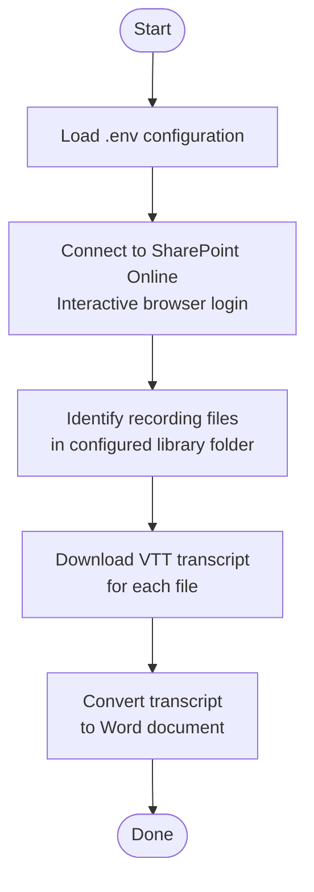

# Invoke-TranscriptExport

Downloads meeting recording transcripts from a SharePoint document library, parses the WebVTT files into timed segments, and writes a structured Word document (`.docx`) for each recording — with headings, speaker attribution, transcript text, and deep-links back to the recording at the correct playback position.

## Requirements

| Requirement | Details |
|---|---|
| PowerShell | 7.0 or later |
| PnP.PowerShell | `Install-Module PnP.PowerShell` |
| Microsoft Word | Must be installed (used via COM interop) |
| Azure AD App Registration | Client ID with delegated SharePoint permissions |

## Setup

1. Copy `.env.example` to `.env` in the same directory as the script.
2. Fill in the values for your environment (see [Configuration](#configuration) below).
3. Run the script — it will open an interactive browser login to authenticate against SharePoint.

## Configuration

All settings are read from a `.env` file in the script directory. Lines starting with `#` are treated as comments.

| Variable | Required | Description | Example |
|---|---|---|---|
| `CLIENT_ID` | Yes | Azure AD app registration client ID used for delegated auth | `00000000-0000-0000-0000-000000000000` |
| `SITE_URL` | Yes | Full URL of the SharePoint site containing the recordings | `https://contoso.sharepoint.com/sites/YourSiteName` |
| `DOCUMENT_LIBRARY` | Yes | Name of the document library where recordings are stored | `Session Recordings` |
| `SHAREPOINT_FOLDER` | No | Sub-folder path within the library to scope the export | `AK` |
| `DESTINATION_FOLDER` | Yes | Local folder where VTT files and Word docs are saved | `C:\Temp\Transcripts` |
| `STREAM_ENDPOINT` | Yes | SharePoint Stream URL path used to build playback links | `/_layouts/15/stream.aspx` |
| `VTT_SEGMENT_SIZE` | No | How many seconds of transcript to group per Word section (default: `30`) | `60` |

### Example `.env`

```env
CLIENT_ID=047b873d-9edb-47f4-b6d9-15caaf083c09

DESTINATION_FOLDER=C:\Temp\Transcripts
VTT_SEGMENT_SIZE=30

SITE_URL=https://contoso.sharepoint.com/sites/YourSiteName
DOCUMENT_LIBRARY=Session Recordings
SHAREPOINT_FOLDER=AK
STREAM_ENDPOINT=/_layouts/15/stream.aspx
```

## Usage

Run the script directly from PowerShell:

```powershell
# From the script directory
.\Invoke-TranscriptExport.ps1
```

```powershell
# From any other location
& "C:\Scripts\GetTranscripts\Invoke-TranscriptExport.ps1"
```

A browser window will open for interactive authentication. After sign-in, the script processes every recording file found in the configured library/folder and writes one `.docx` per recording to `DESTINATION_FOLDER`.

### Output

For each recording **MyMeeting 2024-03-01.mp4**, the script produces:

- `MyMeeting 2024-03-01.vtt` — raw WebVTT transcript downloaded from SharePoint  
- `MyMeeting 2024-03-01.docx` — Word document with the structure below

#### Word Document Structure

```
[H1]  MyMeeting 2024-03-01
[H2]  Overview
      Subject:   MyMeeting 2024-03-01
      File Name: MyMeeting 2024-03-01 - Meeting Recording.mp4
[H2]  Transcript
[H2]  0 - 30          ← segment start/end in seconds
      Speakers: Jane Doe, John Smith
      Hello everyone, thank you for joining today's session...
      [View recording segment]   ← hyperlink deep-links to that position in Stream
[H2]  30 - 60
      ...
```

Each **"View recording segment"** hyperlink opens the recording in SharePoint Stream and seeks directly to the start of that segment.

## Process Flow



## How It Works

### Authentication

Uses PnP.PowerShell's interactive delegated flow (`Connect-PnPOnline -Interactive`) with a registered Azure AD app. No certificate or client secret is required — the user authenticates through their browser.

### Drive ID Construction

The SharePoint transcript API (`/_api/v2.1/drives/{driveId}/items/{itemId}/media/transcripts`) requires a Graph-style drive ID. The script constructs this by concatenating the Site, Web, and List GUIDs as bytes, Base64-encoding the result, and prepending `b!`.

### VTT Parsing

WebVTT cues are parsed line-by-line. Speaker names are extracted from `<v SpeakerName>` inline tags. Complete sentences (ending in `.`, `!`, or `?`) are collected, then grouped into fixed-duration windows controlled by `VTT_SEGMENT_SIZE`. Each window becomes one section in the Word document.

### Word Generation

Word is automated via COM interop. The document is created with `Word.Application`, minimized to avoid UI flicker, and written using `Selection.TypeText()` / `Selection.TypeParagraph()` with named styles (`Heading 1`, `Heading 2`, `Normal`). Hyperlinks are inserted using `Document.Hyperlinks.Add()`. The document is saved with `SaveAs2()` and Word is released.
